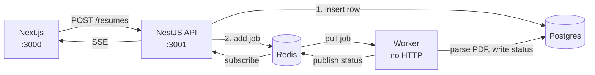

# Resume processing pipeline

Upload a PDF resume, get it parsed by a background worker, and watch the status
change live in the browser. Built to demonstrate a decoupled producer/consumer
architecture with retries, a dead-letter queue and real-time status updates.



The API never parses a PDF. It stores the file, writes a `QUEUED` row, pushes a
job and returns **202 Accepted** immediately. A separate worker process consumes
the queue. Neither process calls the other — their only contract is a queue name
and a job payload of `{ resumeId }`.

## Status lifecycle

```
QUEUED ──▶ PROCESSING ──▶ DONE
              │
              └──▶ FAILED   (after 3 attempts, 2s/4s exponential backoff)
```

Failed jobs stay in Redis's `failed` set (`removeOnFail: false`) — that is the
dead-letter queue. `POST /resumes/:id/retry` removes the dead job and enqueues a
fresh one.

## Stack

| Layer | Choice |
|---|---|
| Monorepo | npm workspaces (`api`, `worker`, `web`) |
| API | NestJS 12 (ESM), port 3001 |
| Worker | NestJS standalone application context, no HTTP server |
| Queue | BullMQ 6 + Redis 7 |
| Database | Postgres 16 + Prisma 7 (`@prisma/adapter-pg`) |
| PDF | unpdf (bundled pdf.js) |
| Frontend | Next.js 16 (App Router) + Tailwind |
| Realtime | Redis pub/sub → Server-Sent Events |
| Ops | Docker Compose, Bull Board |

## Running it

Requires Docker Desktop and Node 22.

```bash
npm install --legacy-peer-deps
cp .env.example .env
docker compose up -d
npx prisma migrate dev
```

Then three terminals:

```bash
npm run start:dev -w api      # http://localhost:3001
npm run start:dev -w worker   # no port
npm run dev -w web            # http://localhost:3000
```

| URL | What |
|---|---|
| http://localhost:3000 | upload, resume list, failed jobs |
| http://localhost:3001/admin/queues | Bull Board queue dashboard |

> `--legacy-peer-deps` works around a peer-resolution crash in npm 10.9.x
> (`Cannot read properties of null (reading 'edgesOut')`). npm 11 doesn't need it.

## Try it

Two fixtures are included:

```bash
curl -F "file=@test-files/sample-resume.pdf" http://localhost:3001/resumes
curl -F "file=@test-files/corrupt-resume.pdf" http://localhost:3001/resumes
```

`corrupt-resume.pdf` has a valid `%PDF` header and nothing else, so it passes
upload validation and fails inside the worker — the retry path, in about
11 seconds. Open `/resumes` in two browser windows first and watch both update
at once: one Redis subscription in the API fans out to every connected client.

Watch the raw events:

```bash
docker exec -it resume-redis redis-cli subscribe resume-status
```

## API

| Method | Path | Notes |
|---|---|---|
| `POST` | `/resumes` | multipart `file`, PDF ≤ 5 MB → **202** `{ id, status }` |
| `GET` | `/resumes` | optional `?status=QUEUED\|PROCESSING\|DONE\|FAILED` |
| `GET` | `/resumes/:id` | full row including extracted text |
| `GET` | `/resumes/:id/events` | SSE: current state, then live updates |
| `GET` | `/resumes/events` | SSE: updates for every resume |
| `POST` | `/resumes/:id/retry` | only valid on `FAILED` |

## Design notes

**Jobs carry a pointer, not data.** The payload is `{ resumeId }`. Redis holds
jobs in memory, so a base64 PDF would be wasteful, and the worker reading the
row itself means it can never act on a stale copy.

**`jobId` is the resume id.** Adding a job with an existing id is ignored, which
makes enqueueing idempotent — and makes retry a two-step operation (remove the
dead job, then add a fresh one).

**Validation happens twice.** The browser checks type and size for fast
feedback; the API checks the first four bytes are `%PDF`, because anyone can
bypass the browser with curl.

**Snapshot plus stream.** Redis pub/sub has no memory — a client that connects
after an event simply never sees it. Each SSE connection therefore starts with
the current row from Postgres, then continues with live events.

**Failure handling lives outside `process()`.** A thrown error is what triggers
BullMQ's retry. Only the queue knows whether an attempt was the last one, so
`FAILED` is written from an `@OnWorkerEvent('failed')` handler.

## Known tradeoffs

- **Orphan rows.** The row insert and the `queue.add` aren't atomic. If the
  process dies between them, the row sits in `QUEUED` forever with no job. A
  transactional outbox, or a sweeper that re-enqueues stale `QUEUED` rows,
  would close this. (`@@index([status])` is already there for that query.)
- **Every failure is retried 3 times**, including permanently broken PDFs.
  BullMQ's `UnrecoverableError` would let genuinely permanent failures skip
  straight to the dead-letter queue.
- **Bull Board is unauthenticated** and exposes job payloads — localhost only.
- **One pub/sub channel** means every API instance receives every event. Fine at
  this scale; per-resume channels or sharding would be needed beyond it.
- **Files are stored on local disk.** S3 or another object store would be needed
  before running more than one API instance.

## Possible next steps

AI summarization of the extracted text (the `summary` column is reserved for
it), OCR for scanned PDFs that extract to empty text, and authentication so
resumes are scoped to a user.